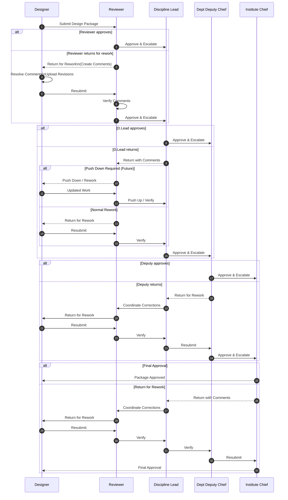

# EPC Review Workflow

```mermaid
sequenceDiagram
    autonumber

    participant Designer
    participant Reviewer
    participant DLead as Discipline Lead
    participant Deputy as Dept Deputy Chief
    participant Chief as Institute Chief

    %% =========================
    %% Initial Submission
    %% =========================

    Designer->>Reviewer: Submit Design Package

    %% =========================
    %% Reviewer Stage
    %% =========================

    alt Reviewer approves
        Reviewer->>DLead: Approve & Escalate
    else Reviewer returns for rework
        Reviewer-->>Designer: Return for Rework\n(Create Comments)
        Designer->>Designer: Resolve Comments\nUpload Revisions
        Designer->>Reviewer: Resubmit
        Reviewer->>Reviewer: Verify Comments
        Reviewer->>DLead: Approve & Escalate
    end

    %% =========================
    %% Discipline Lead
    %% =========================

    alt D.Lead approves
        DLead->>Deputy: Approve & Escalate
    else D.Lead returns
        DLead-->>Reviewer: Return with Comments

        alt Push Down Required (Future)
            Reviewer-->>Designer: Push Down / Rework
            Designer->>Reviewer: Updated Work
            Reviewer->>DLead: Push Up / Verify
        else Normal Rework
            Reviewer-->>Designer: Return for Rework
            Designer->>Reviewer: Resubmit
            Reviewer->>DLead: Verify
        end

        DLead->>Deputy: Approve & Escalate
    end

    %% =========================
    %% Deputy Chief
    %% =========================

    alt Deputy approves
        Deputy->>Chief: Approve & Escalate
    else Deputy returns
        Deputy-->>DLead: Return for Rework
        DLead->>Reviewer: Coordinate Corrections
        Reviewer->>Designer: Return for Rework
        Designer->>Reviewer: Resubmit
        Reviewer->>DLead: Verify
        DLead->>Deputy: Resubmit
        Deputy->>Chief: Approve & Escalate
    end

    %% =========================
    %% Institute Chief
    %% =========================

    alt Final Approval
        Chief-->>Designer: Package Approved
    else Return for Rework
        Chief-->>DLead: Return with Comments
        DLead->>Reviewer: Coordinate Corrections
        Reviewer->>Designer: Return for Rework
        Designer->>Reviewer: Resubmit
        Reviewer->>DLead: Verify
        DLead->>Deputy: Verify
        Deputy->>Chief: Resubmit
        Chief-->>Designer: Final Approval
    end
```